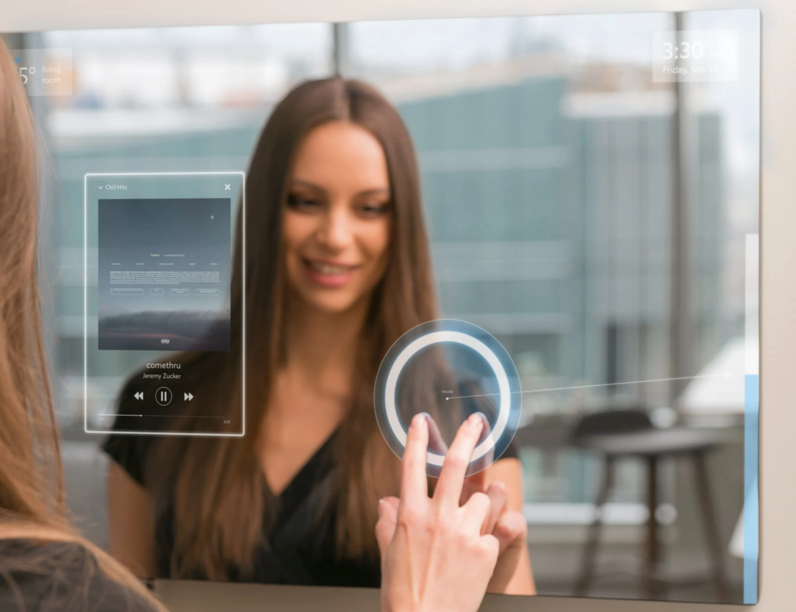
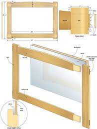
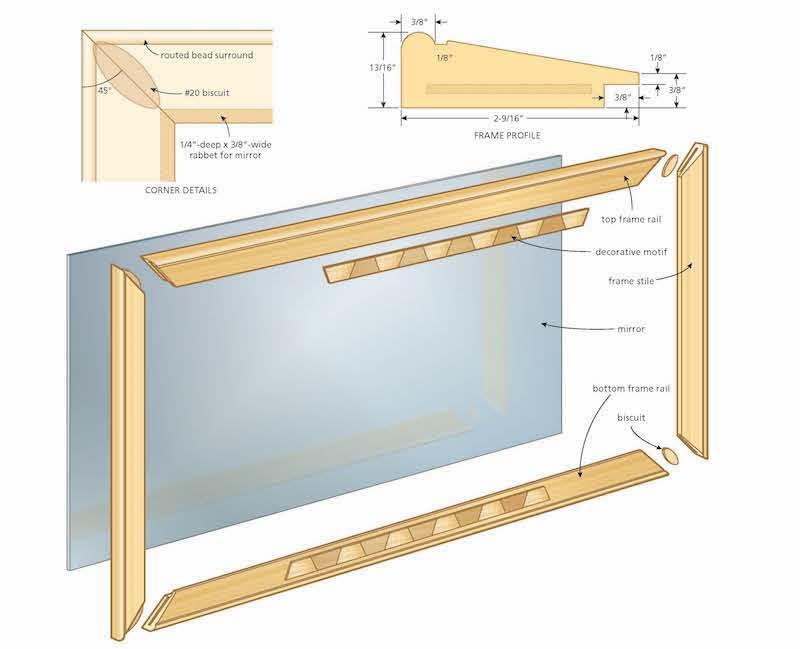

 

# SMART MIRROR 

## Description:-
   #### A smart mirror, also known as a magic mirror, displays the time, weather, calendar, news, and social media updates. The magic is created by placing a transparent mirror over a screen such as a tablet, monitor, or TV. The technology is driven by a Raspberry Pi or combined Windows PC, with voice recognition and touch technology.

<h3 align="center"> 
</h3>
   

  
<h1 align="center"> MATERIAL </h1>

| Components-Required     |Cost | 
| :---:        |    :----   |  
| [Raspberry pi 4 module]()     | 5000/-. 
| [Pi 4 case ]()   | 250/-.    | issued.© 2021 Shivam Garg
| [Pi 4 adapter ]()     | 750/- |
| [LED monitor ]()     | 10000/-. 
| [Two-way mirror ]()     | 100/-. 
| [SD card (32 GB) ]()     | 400/-. 
| [HDMI cable ]()     | 200/-. 
| [Speaker ]()     | 500/-. 
| [Microphone]()     | 200/-. 
| [LED lights ]()     | 400/-.
| Total Components-Cost    | 20,200/- | 

# : Procedure :
## Step:1  Frame Design 

### First things First, we need to make the frame of the smart mirror.
<h3 align="center"> 
</h3>
<h3 align="center">   
</h3>

