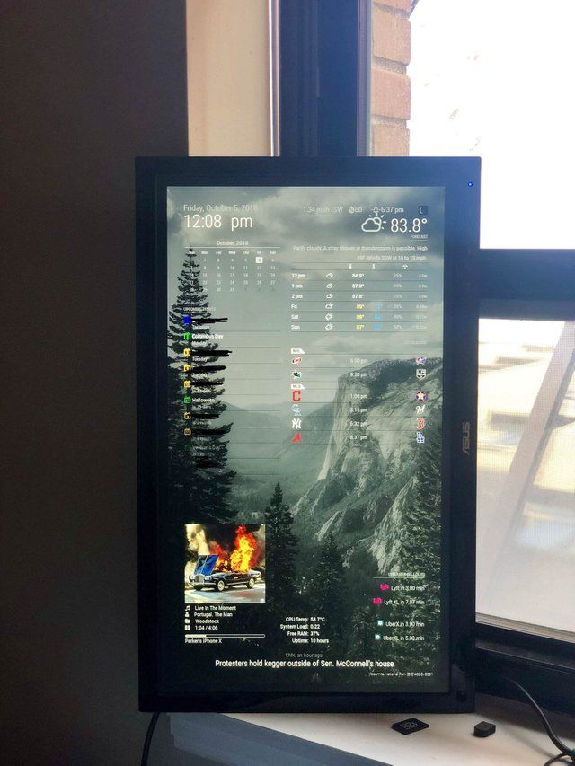
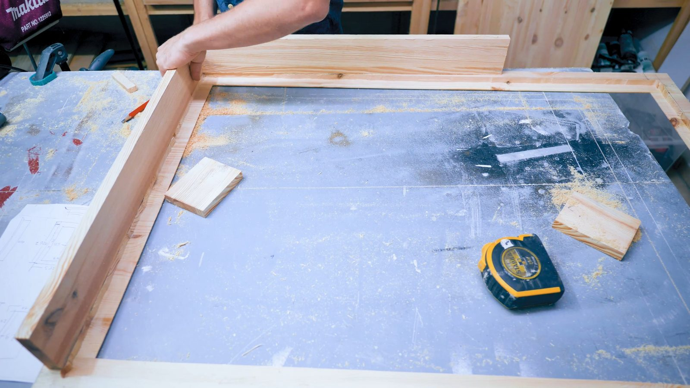
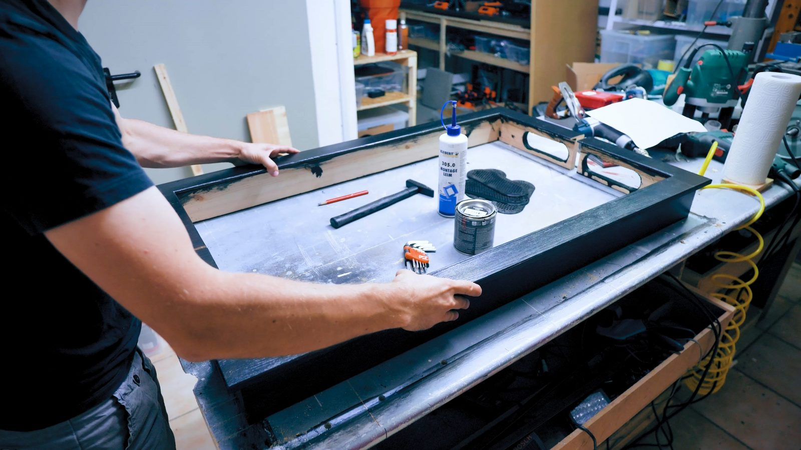
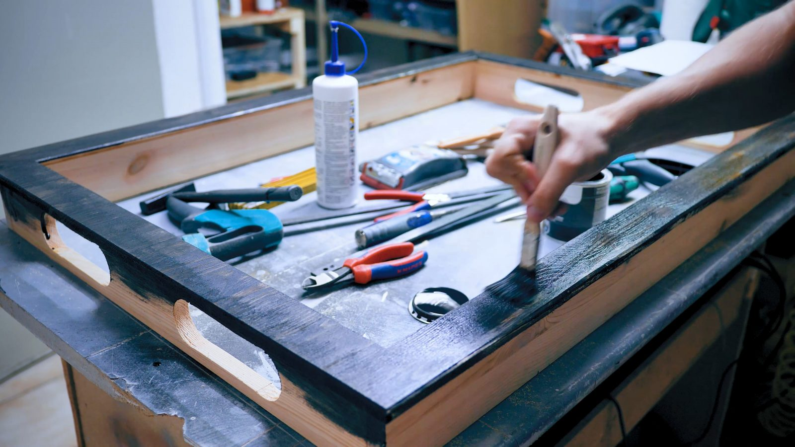
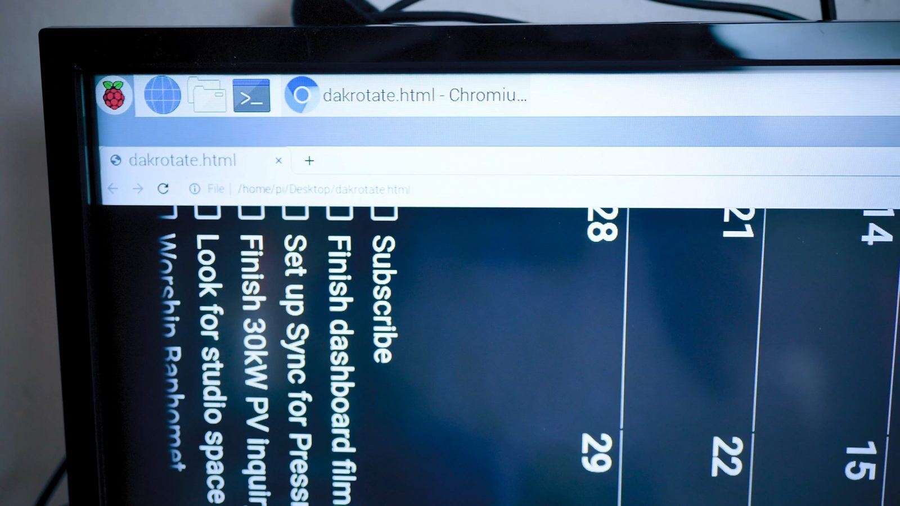
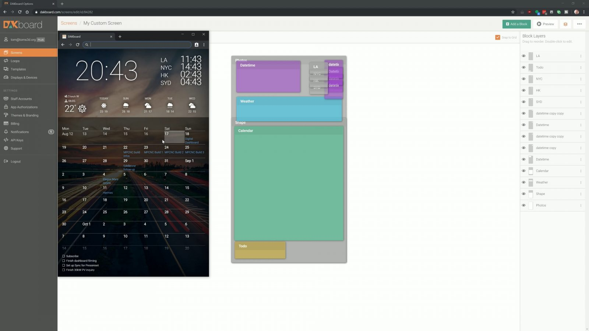
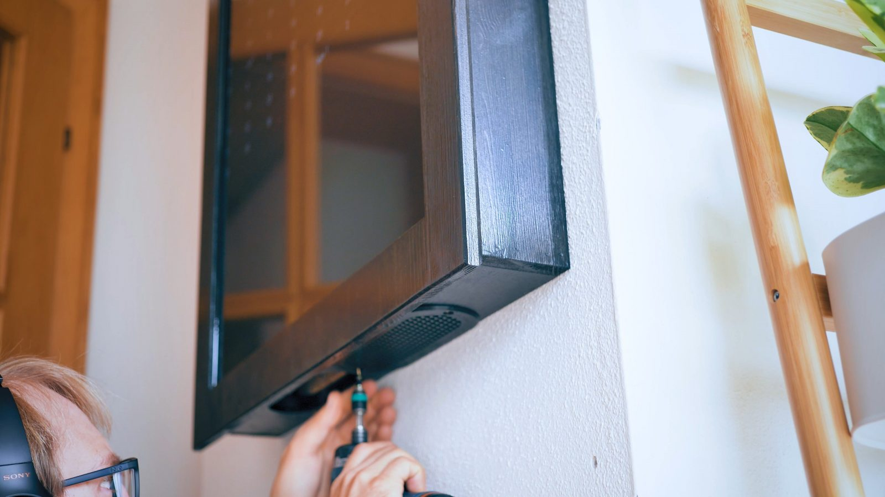
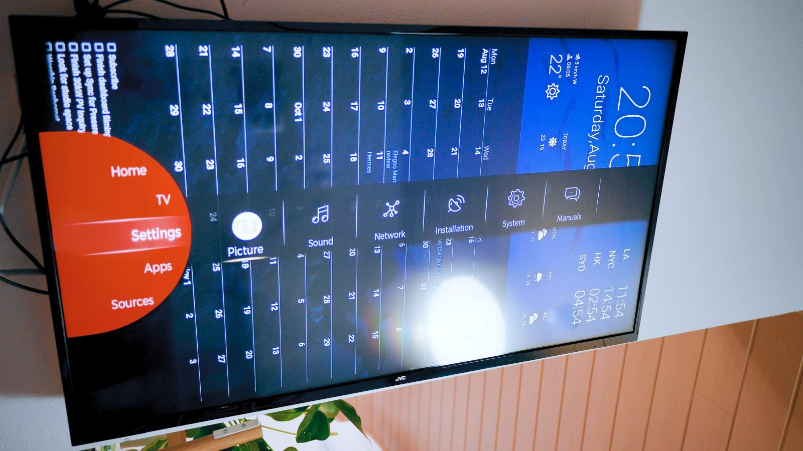
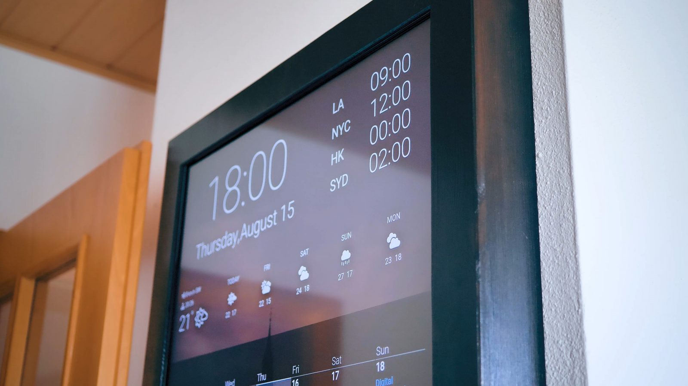

 

# SMART MIRROR 

## Description:-
   #### A smart mirror, also known as a magic mirror, displays the time, weather, calendar, news, and social media updates. The magic is created by placing a transparent mirror over a screen such as a tablet, monitor, or TV. The technology is driven by a Raspberry Pi or combined Windows PC, with voice recognition and touch technology.

<h3 align="center"> 
</h3>
   

  
<h1 align="center"> MATERIAL </h1>

| Components-Required     |Cost | 
| :---:        |    :----   |  
| [Raspberry pi 4 module](https://www.amazon.in/s?k=rasberry+pi+4&ref=nb_sb_ss_ts-doa-p_6_3)     | 5000/-. 
| [Pi 4 case](https://www.amazon.in/s?k=pi+case&ref=nb_sb_noss_2)   | 250/-.    | issued.© 2021 Shivam Garg
| [Pi 4 adapter ](https://www.amazon.in/s?k=pi+adapter&ref=nb_sb_noss_2)     | 750/- |
| [LED monitor ](https://www.amazon.in/s?k=lcd+monitor&ref=nb_sb_noss_2)     | 10000/-. 
| [Two-way mirror ]()     | 100/-. 
| [SD card (32 GB) ](https://www.amazon.in/s?k=sd+card+32+gb&ref=nb_sb_ss_ts-doa-p_4_4)     | 400/-. 
| [HDMI cable ](https://www.amazon.in/s?k=hdmi+cables&ref=nb_sb_ss_ts-doa-p_4_7)     | 200/-. 
| [Speaker ](https://www.amazon.in/s?k=small+speaker&ref=nb_sb_noss_1)     | 500/-. 
| [Microphone](https://www.amazon.in/s?k=microphone&ref=nb_sb_noss_2)     | 200/-. 
| [LED lights ](https://www.amazon.in/s?k=lcd+light&ref=nb_sb_noss_1)     | 400/-.
| Total Components-Cost    | 20,200/- | 

# : Procedure :
## Step:1  Frame Design 

### First things First, we need to make the frame of the smart mirror.
<h3 align="center">   
</h3>
<h3 align="center"> 
</h3>
<h3 align="center"> 
</h3>

 

# Step:2 Installation
### We need to install few software’s and module to obtain the desired result facilities we need as our output in the smart mirror.

<h3 align="left">
>>	Install Raspberry Pi OS  
>>	Install Magic Mirror  
>>	install modules   
>>	Magic Mirror Auto Start  
>>	Raspberry Pi auto restart  
</h3>
<h3 align="left"></h3> 
<h3 align="left"></h3> 

## IF you want a Guide to install all the softwares you can check out this blog post [Program the Raspberry Pi for SMART MIRROR](https://shivanshh.hashnode.dev/program-the-raspberry-pi-for-smart-mirror)
 

# Step:3 INTEGRATION
### NOW it’s the time to integrate all the components, in the previous steps we are done with the frame and software installed raspberry pi. Now we have to integrate the following into the frame: -

<h3 align="left">
>monitor screen  
>Two-way mirror  
>raspberry pi  
>led light  
The rest work is of connections. Now, Connection needs to be done carefully and the connection should be more Clean and well connected. 

</h3>
<h3 align="center"> 
</h3>
<h3 align="center"> 
</h3>
 

# Step:4 Final Outlook

## <b>Hurray!!!!!!</b>
   ### This is the final outlook of the project.
### In this we will get our reflection with the digital updation of various feature in the mirror itself.

<h3 align="center"> 
 </h3>
<h3 align="center"> 
 </h3>

<h2>📬 Contact</h2>

If you want to contact me, you can reach me through below Social handles.

<a href="mailto:shivanshagarwal2020@gmail.com">

 

